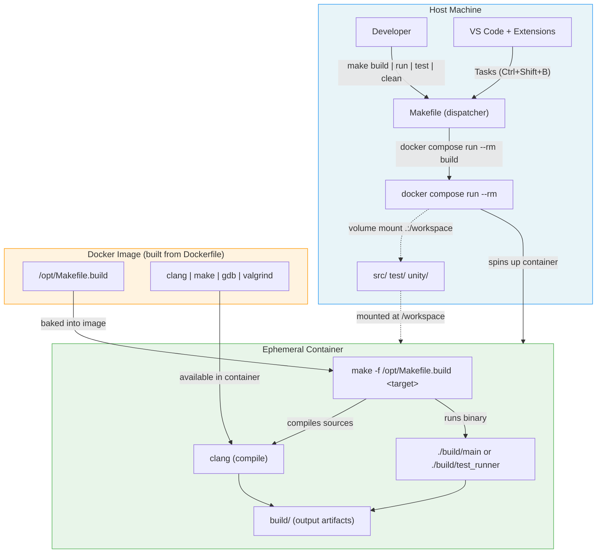
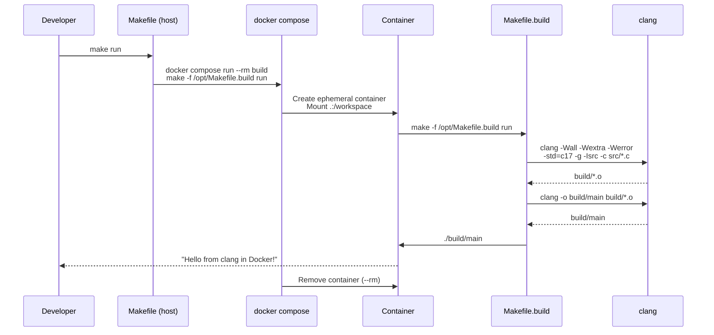

# c_sandbox02 — Compiler-Only Docker C Project

A C project that uses Docker purely as a compilation and build tool. VS Code and all editor tooling run natively on the host machine. Docker is invoked only for building, testing, and running the compiled binary.

## How It Works

Unlike a Dev Container approach (where VS Code itself runs inside Docker), this project keeps everything on the host except the compiler toolchain. The Makefile provides host-facing targets that wrap `docker compose run --rm` to execute short-lived build commands inside a container.

This is a lighter-weight approach:
- No "Reopen in Container" step
- No Dev Containers extension required
- Docker containers are ephemeral — spun up per command, then removed
- Editor extensions (IntelliSense, clang-format) run on the host

## Prerequisites

- [Docker Desktop](https://www.docker.com/products/docker-desktop/) (or Docker Engine + Compose)
- Make (pre-installed on macOS)
- VS Code with recommended extensions (optional)

No Dev Containers extension needed.

## Quick Start

```bash
git clone --recurse-submodules <repo-url>
cd c_sandbox02
make run
```

On first run, Docker will build the compiler image (takes ~1 minute). Subsequent runs reuse the cached image.

## Makefile Reference

| Command | Description |
|---------|-------------|
| `make build` | Compile the project |
| `make run` | Build and run the binary |
| `make test` | Build and run unit tests |
| `make clean` | Remove build artifacts |

### How the Split Makefile Works

Build logic is split across two Makefiles:

- **`Makefile`** (host) — a thin dispatcher that calls `docker compose run --rm build make -f /opt/Makefile.build <target>`, spinning up a short-lived container for each command.
- **`Makefile.build`** (container) — baked into the Docker image at `/opt/Makefile.build`. Contains all compiler config, source/object rules, and test compilation. This file is never referenced from the host directly.

You always run the host-facing targets (`make build`, `make run`, etc.). The container-internal Makefile is an implementation detail.

## Architecture



### Build Flow



## Project Structure

```
c_sandbox02/
├── Dockerfile              # Compiler image (clang, make, gdb, valgrind)
├── docker-compose.yml      # Service definition for build container
├── Makefile                # Host-side dispatcher (docker compose run)
├── Makefile.build          # Container-internal build logic (baked into image)
├── CLAUDE.md               # Claude Code instructions
├── README.md               # This file
├── .gitignore
├── .vscode/
│   ├── tasks.json          # Build/Run/Test/Clean tasks
│   ├── settings.json       # Editor settings (C17, format-on-save)
│   └── extensions.json     # Recommended extensions (no remote-containers)
├── src/
│   ├── main.c              # Entry point
│   ├── greeter.h           # Greeter module header
│   └── greeter.c           # Greeter module implementation
├── test/
│   └── test_greeter.c      # Unit tests
└── unity/                  # Unity test framework (git submodule)
```

## Testing

Tests use the [Unity](https://github.com/ThrowTheSwitch/Unity) test framework, included as a git submodule.

```bash
make test
```

## Comparison with Dev Container Approach

| Aspect | Dev Container (c_sandbox01) | Compiler-Only (this project) |
|--------|---------------------------|------------------------------|
| VS Code | Runs inside container | Runs on host |
| Extensions | Installed in container | Installed on host |
| Docker usage | Always running (`docker compose up`) | Short-lived (`docker compose run --rm`) |
| `.devcontainer/` | Required | Not needed |
| Startup | "Reopen in Container" | Just `make run` |
